<!-- _class: title -->
<h1></h1>
<h2></h2>

---

# About me

- [Miguel Ureña Pliego](https://miguelurenapliego.github.io/) 

- MEng Civil Engineering at UPM (Spain)

- Visiting Student @ City Science (September 25 to March 2026)

- No drivers licence 
(but licence to build roads)

- I like cats 

---

# Cities are important

  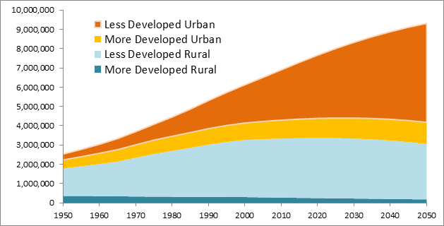

- Urban population growth 

- Asia exploded

- Africa? 

---

# Cities are important

<iframe
  src="html/france.html"
  style="width: 100%; height: 580px; border: w;">
</iframe>

- Cities always had power and identity 

- A world of cities beyond nation states...

---

# The city science network

      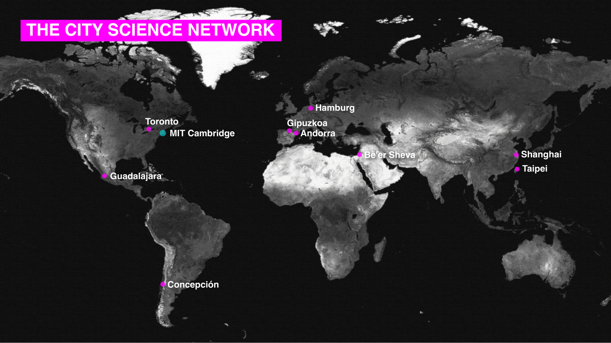

- MIT Media Lab City Science

- 10 city science labs 

- Close relationship with local administration

- North/south America, Europe and Asia 

---

# What is accessibility?

<iframe
  src="html/cambridge_pt_access.html"
  style="width: 100%; height: 580px; border: w;">
</iframe>

- Good KPI for coverage 

- Points of Interest (PoIs) + Distance / Time

- Very related to the 15-min-city

- Access if you don't drive?

- Work with [Naroa Coretti](https://www.media.mit.edu/people/naroa/overview/)

---
# But not every PoI is equally attractive...

<!-- Left box -->

- Transit stop: 
**Subway vs bus**

- Groceries:
**Large chain vs small shop**

<!-- Arrow -->

→

<!-- Right formula -->

$$
\text{Accessibility} = \text{PoI quality}
\times \text{Distance}
$$

---

# Motivation

  <iframe
    src="html/eldiario/index.html"
    style="width: 100%; height: 580px; border: w;">
  </iframe>

  <!-- 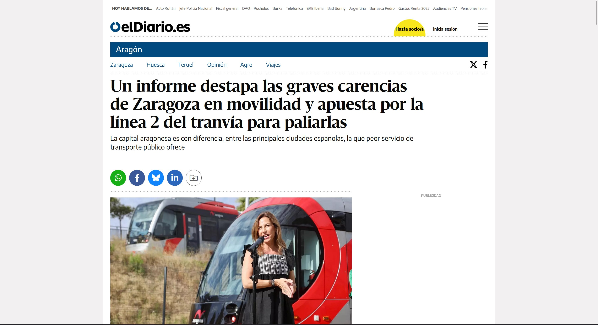 -->

---

# Accessibility to public transport

<!-- Left text -->

<!-- Right formula -->

$$
\text{Accessibility} = \text{PoI quality}
\times \text{Distance}
$$

---

# The city science accessibility contest

|  |  |  |
|:---------------------------------------------------------------------------------------:|:--------------------------------------------------------------------------------------:|:---------------------------------------------------------------------------------------:|
|       |      |  |

---

# Accessibility to public transport

<!-- Left text -->

- PoIs - Stops

<!-- Right formula -->

$$
\text{Accessibility} = 
  \overbrace{
      \text{PoI quality}
  }^{\text{Public Transport quality}}
\times \text{Distance}
$$

---

# Accessibility to public transport

<!-- Left text -->

- PoIs - Stops

- Stop quality

<!-- Right formula -->

$$
\text{Accessibility} = 
  \overbrace{
      \text{headway} \cdot 
      \text{speed}\cdot 
      \text{mode}
  }^{\text{Public Transport quality}}
\times \text{Distance}
$$

---

# Accessibility to public transport

<!-- Left text -->

- PoIs - Stops

- Stop quality

- Normalization $[0,1]$

<!-- Right formula -->

$$
\underbrace{\text{Accessibility}}_{[0, 1]} = 
    \overbrace{
        \underbrace{\text{headway}}_{[0, 1]} \cdot 
        \underbrace{\text{speed}}_{[0, 1]} \cdot 
        \underbrace{\text{mode}}_{[0, 1]}
    }^{\text{public transport quality}}
\times \underbrace{\text{distance}}_{[0, 1]}
$$

---

# Quality functions

  <!-- Left column: formulas -->
  

    
  $$\text{Distance} \to [0,1]$$
    
  Exponential decay function - Elasticity:
    
  $$e = \frac{\%\text{ change in Demand } (\approx \text{ Quality})}{\%\text{ change in Distance}}$$

  

  <!-- Right column: iframe graph -->
  

    <iframe 
      src="html/elasticity_graph.html"
      style="
        width: 100%;
        height: 100%;
        border: w;
      ">
    </iframe>
  

---

# Accessibility to public transport

  <!-- Left column: bullets with arrow -->
  

  <!-- First two bullets -->
  

  - PoIs - Stops 
  - Stop quality

  <!-- Vertical arrow -->
  

    

    
↓

  

  

  <!-- Last bullet -->
  

  - Timetables

  

  

  <!-- Right column: accessibility formula -->
  

  $$
  \text{Accessibility} =
  \overbrace{
    \color{red}{\fbox{$\text{headway} \;\cdot\; \text{speed} \;\cdot\; \text{mode}$}}
  }^{\text{Public Transport quality}}
  \times \text{Distance}
  $$

  

---

# Public transport timetables: GTFS

  <!-- LEft column -->
  

  ## Global standard

  - [**Mobility Database API**](https://mobilitydatabase.org) 

  - [**Transitland API**](https://www.transit.land)

  - Local agencies (mandatory in the EU)

  

  <!-- Right column -->
  

    <!-- Image wrapper: flex-grow to take most of the space -->
    

      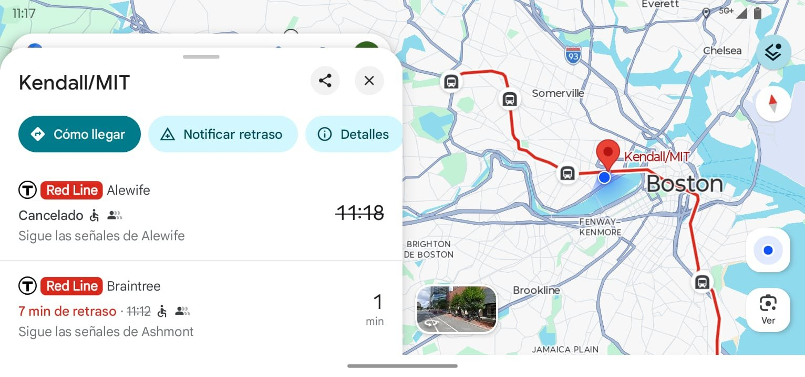
    

    <!-- Text at bottom -->
    
We all use it

  

---

# Not that easy...

  <!-- LEft column -->
  

  <!-- First step -->
  

  

    ✅ GTFS → stop location
  

   
   
   

  

  <!-- Second step -->
  

  

    ☹️ GTFS → headway, speed, mode
  

  
  

  

  <!-- Right column -->
  

    <!-- Image wrapper: flex-grow to take most of the space -->
    

      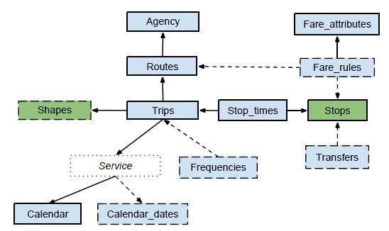
    

    <!-- Text at bottom -->
    
GTFS file structure

  

---

# Stop quality

$$
\text{Accessibility} =
\overbrace{
  \color{red}{\fbox{$\text{headway}$}} \color{white}{\;\cdot\; \text{speed} \;\cdot\; \text{mode}
}}^{\text{Public Transport quality}}
\times \text{Distance}
$$

---

# Headway

<!-- Row with two images side by side -->

  <!-- Left image -->
  

    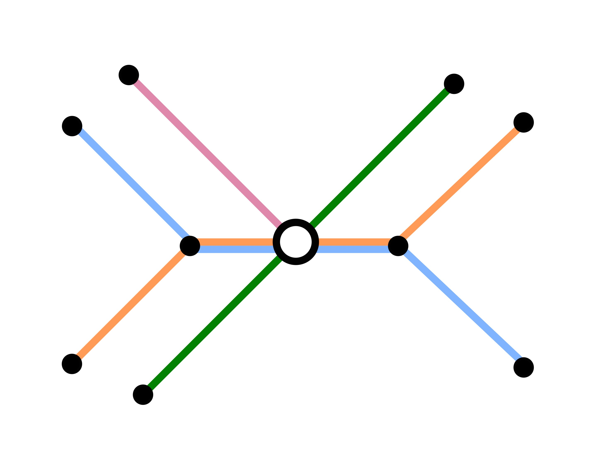
  

  <!-- Right image -->
  

  Contribution of multiple routes?

  

---

# Headway

<!-- Row with two images side by side -->

  <!-- Left image -->
  

    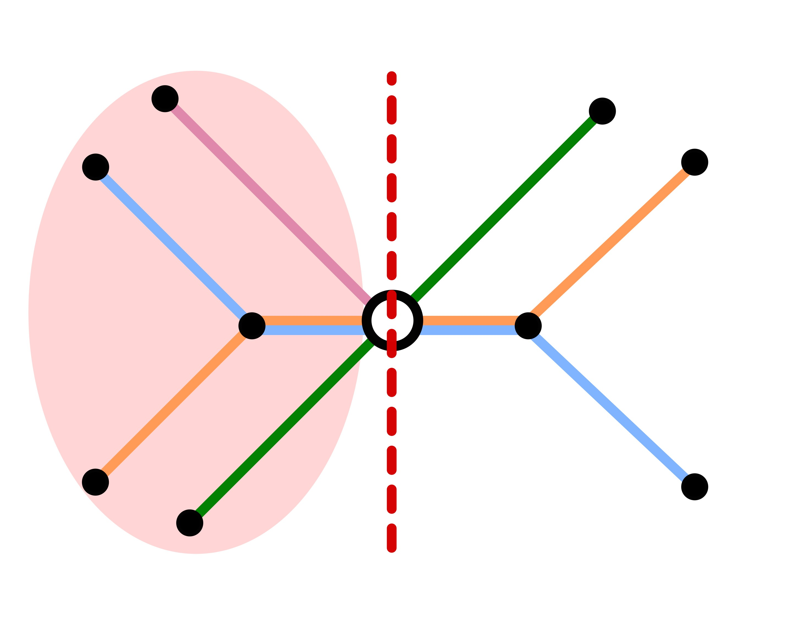
  

  <!-- Right image -->
  

  Harmonic mean
  $\text{HM} = 1/\left[\text{mean}\left(\frac{1}{\text{headway}_i}\right)\right]$

  

---

# Headway: Trips and routes

<!-- Row with two images side by side -->

  <!-- Left image -->
  

    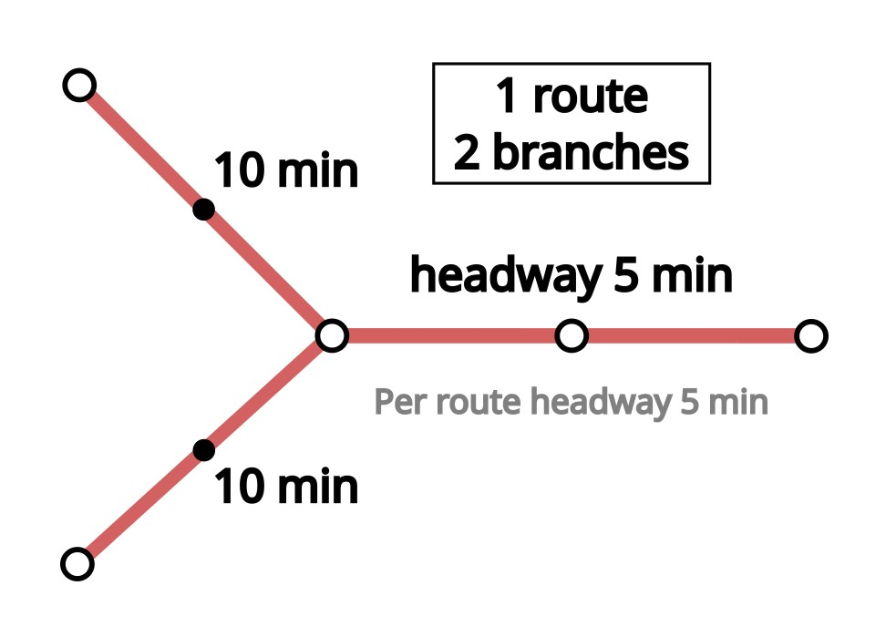
  

  <!-- Right image -->
  

    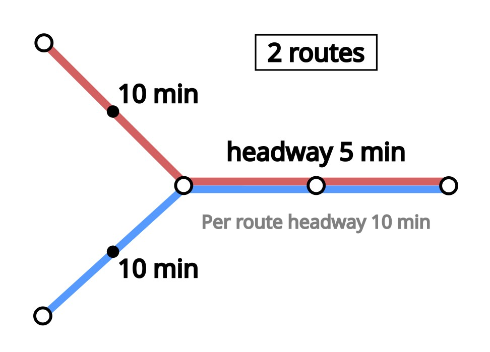
  

<!-- Subtitle below both images -->

  The problem with the 'route' concept. Better use trips.

---

# Headway

  <!-- Left column: Text with top gap -->
  

    
<strong>Elasticity:</strong>

    
Theoretical value:  
    0.5 (Mohring's Law)

    
Empirical: 
    &lt; 30 min: e = 0.3 to 0.5 
    &gt; 60 min: e = 0.6 to 1

  

  <!-- Right column: Image aligned to top -->
  

  <iframe
    src="html/cambridge_pt_headway.html"
    style="width: 100%; height: 500px; border: w;margin-top: -6rem;">
  </iframe>
  

---

# Stop quality

$$
\text{Accessibility} =
\overbrace{
  \text{headway} \;\cdot\; \color{red}{\fbox{\text{speed}}} \color{white}{\;\cdot\; \text{mode}
}}^{\text{Public Transport quality}}
\times \text{Distance}
$$

---

# Speed

<!-- Left side: bullet points -->

- Per trip and stop  

- Measured ±15 minutes around each stop

- Elasticity: $e = 0.1 - 0.4$ (smaller than headway)

<!-- Right side: map -->

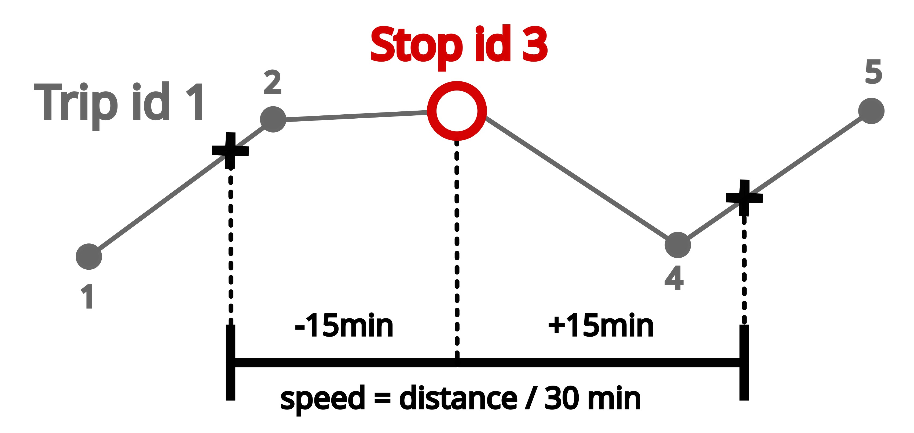

---

# Speed

<!-- Left side: bullet points -->

- Per trip and stop  

- Measured ±15 minutes around each stop

- Elasticity: $e = 0.1 - 0.4$ (smaller than headway)

<!-- Right side: map -->

<iframe
  src="html/cambridge_pt_speed.html"
  style="width: 100%; height: 500px; border: w;margin-top: -6rem;">
</iframe>

---

# Stop quality

$$
\text{Accessibility} =
\overbrace{
  \text{headway} \;\cdot\; \text{speed} \;\cdot\; \color{red}{\fbox{\text{mode}}}
}^{\text{Public Transport quality}}
\times \text{Distance}
$$

---

# Mode

<!-- Left side -->

### Values
- **Bus**: $0.5 - 0.9$
- **LRT/BRT (tram)**: $0.75 - 0.95$
- **Subway/Train (rail)**: $1$

User comfort and capacity   

`route_type` column in GTFS

No specific ID for BRT services

<!-- Right side -->

<iframe
  src="html/cambridge_pt_mode.html"
  style="width: 100%; height: 500px; border: w;margin-top: -6rem;">
</iframe>

---

# Accessibility

$$
\text{Accessibility} =
\overbrace{
  \text{headway} \;\cdot\; \text{speed} \;\cdot\; \text{mode}
}^{\text{Public Transport quality}}
\times \color{red}{\fbox{\text{Distance}}}
$$

---

# Distance/Time: Isochrones

<!-- Left side: bullet points -->

- The area reachable in **X minutes** 
with a specific transport **mode**
(public transport, walk, bike, car, etc.)

- Transport system graph 

- For accessibility to public transport: 
walk isochrones

- Elasticity: $e = 0.1 - 0.4$ 
(smaller than headway)

<!-- Right side: figure -->

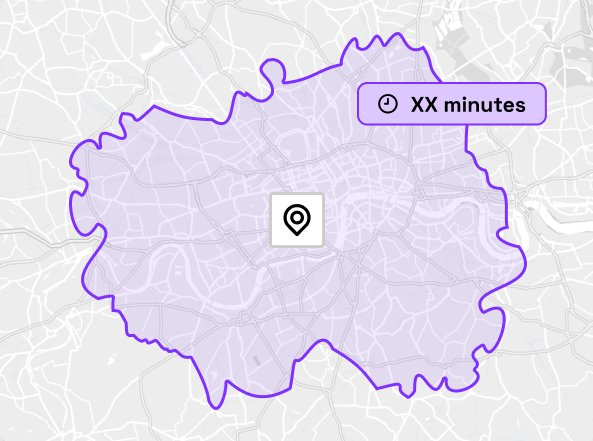

---

# A bit of graph theory

<!-- Left side: bullet points -->

- Transport system graph 
(source: OpenStreetMap streets)  

- Geo-multi-source **Dijkstra**
adds exact nodes at breakpoints

- Discrete distances 

- Discrete stop qualities 

<!-- Right side: figure -->

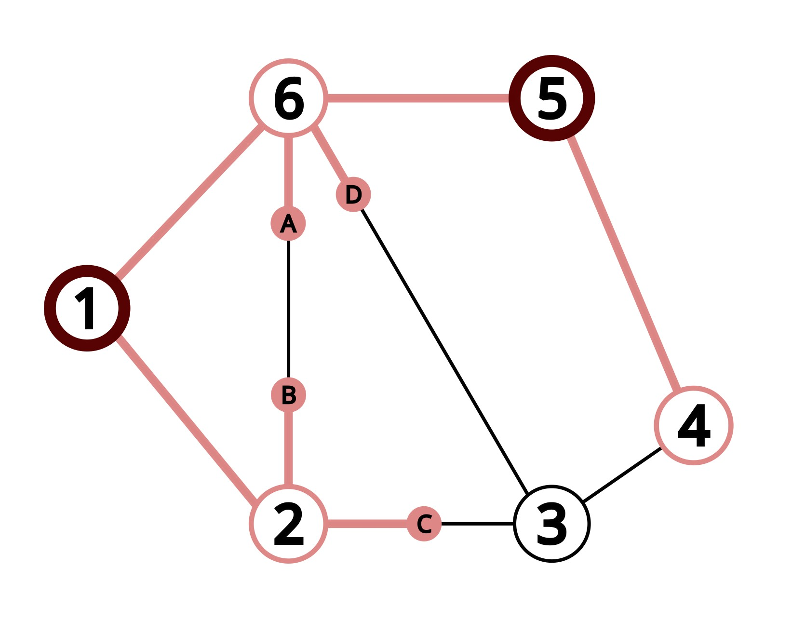

---
# Discretization

  1. Choose discrete accessibility grades

  

  
0

  
0.1

  
0.2

  
0.3

  
0.4

  
0.5

  
0.6

  
0.7

  
0.8

  <!-- added -->
  
0.9

  
1

2. Stop quality and distance are discretized automatically 

---
# An example result

<iframe
  src="html/cambridge_pt_access.html"
  style="width: 100%; height: 700px; border: w; margin-top: -8rem">
</iframe>

---
# Population/Census

<!-- Left side: map -->

<iframe
  src="html/cambridge_pt_population.html"
  style="width: 100%; height: 400px; border: w;">
</iframe>

<!-- Right side: bullet points -->

- Global source: [WorldPop](https://www.worldpop.org)  

- Census data: Individual countries

---
# This idea is flexible!

<!-- Left side: bullet points -->

- Park quality by its **area**

<!-- Right side: map -->

<iframe
  src="html/cambridge_park_access.html"
  style="width: 100%; height: 430px; border: w;">
</iframe>

---

# Introducing perception

<!-- Left side: bullet points -->

- Work with [Leticia Izquierdo](https://www.media.mit.edu/people/leticiai/projects/) 

- Pairwise comparisons

- Image vision model

- Small sample size

- Different profiles

- Perceived distances

<!-- Right side: map -->

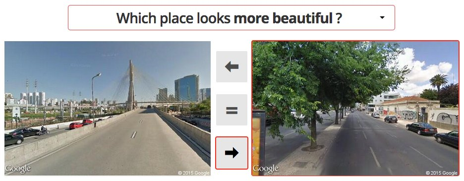

---

# Introducing perception

<!-- Left side: bullet points -->

- Work with [Leticia Izquierdo](https://www.media.mit.edu/people/leticiai/projects/) 

- Pairwise comparisons

- Image vision model

- Small sample size

- Different profiles

- Perceived distances

<!-- Right side: map -->

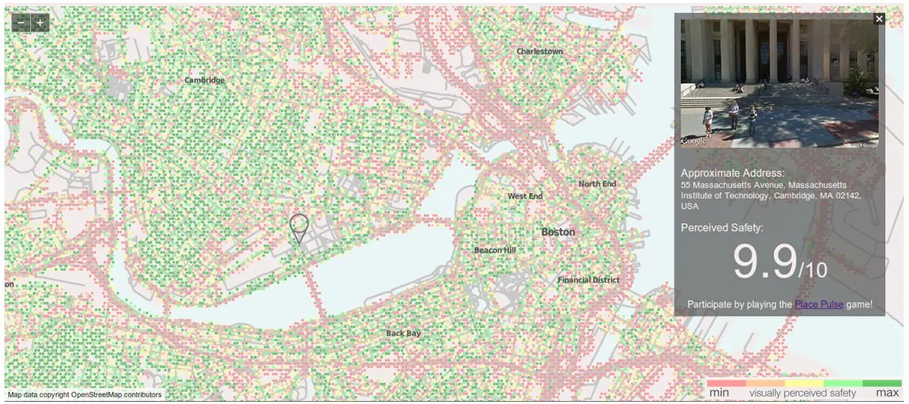

---

# Connecting with DUSP

<!-- Left side: bullet points -->

- Coffee and transit

  - Speaker next Wendesday

<!-- Right side: map -->

  <iframe
    src="html/coffee_and_transit/index.html"
    style="width: 100%; height: 450px; border: w;">
  </iframe>

<!-- 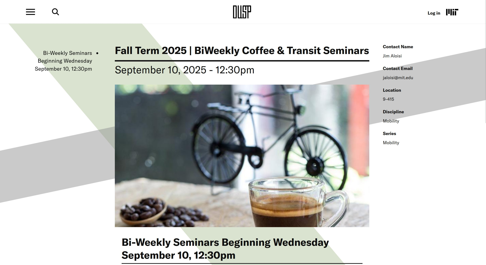 -->

---

# Connecting with DUSP

<!-- Left side: bullet points -->

- City Science San Francisco: 

  - Affordable housing 

  - Erik Huntley: Who owns Massachusetts?

<!-- Right side: map -->

<iframe
  src="https://who-owns-mass.org/"
  style="width: 100%; height: 450px; border: w;">
</iframe>

---
# Results

---

<iframe
  src="html/boston.html"
  style="width: 100%; height: 850px; border: w; margin-top: -8rem">
</iframe>

---

<iframe
  src="html/san_francisco.html"
  style="width: 100%; height: 850px; border: w; margin-top: -8rem">
</iframe>

---

<iframe
  src="html/toronto_res_7.html"
  style="width: 100%; height: 850px; border: w; margin-top: -8rem">
</iframe>

---

<iframe
  src="html/guadalajara.html"
  style="width: 100%; height: 850px; border: w; margin-top: -8rem">
</iframe>

---

<iframe
  src="html/gipuzkoa.html"
  style="width: 100%; height: 850px; border: w; margin-top: -8rem">
</iframe>

---

<iframe
  src="html/hamburg_res_7.html"
  style="width: 100%; height: 850px; border: w; margin-top: -8rem">
</iframe>

---

<iframe
  src="html/new_city_with_stops.html"
  style="width: 100%; height: 850px; border: w; margin-top: -8rem">
</iframe>

---

<iframe
  src="html/new_city.html"
  style="width: 100%; height: 850px; border: w; margin-top: -8rem">
</iframe>

---

# Equity 

  <!-- Left column: Text with top gap -->
  

  - Population density

  - Home ownership 

  - Car ownership

  - Race

  - Income

  

  <!-- Right column: Image aligned to top -->
  

    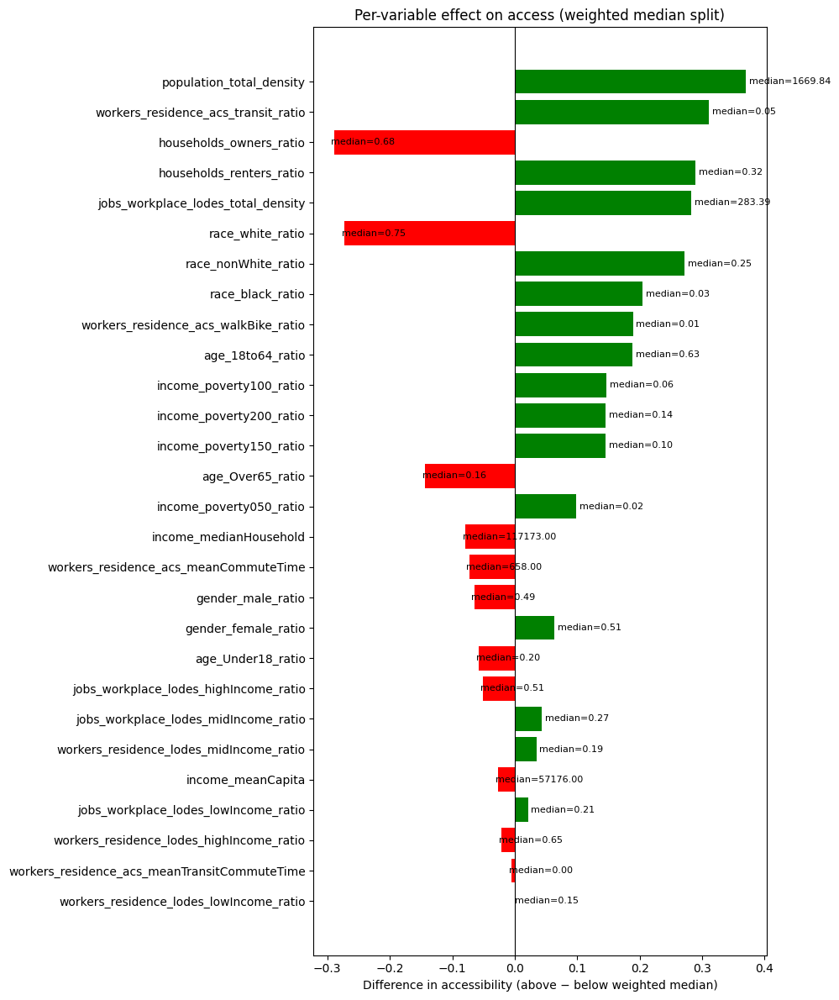
  

---

# Equity 

  <!-- Left column: Text with top gap -->
  

  - Population density

  - Home ownership 

  - Car ownership

  - Race

  - Income

  

  <!-- Right column: Image aligned to top -->
  

    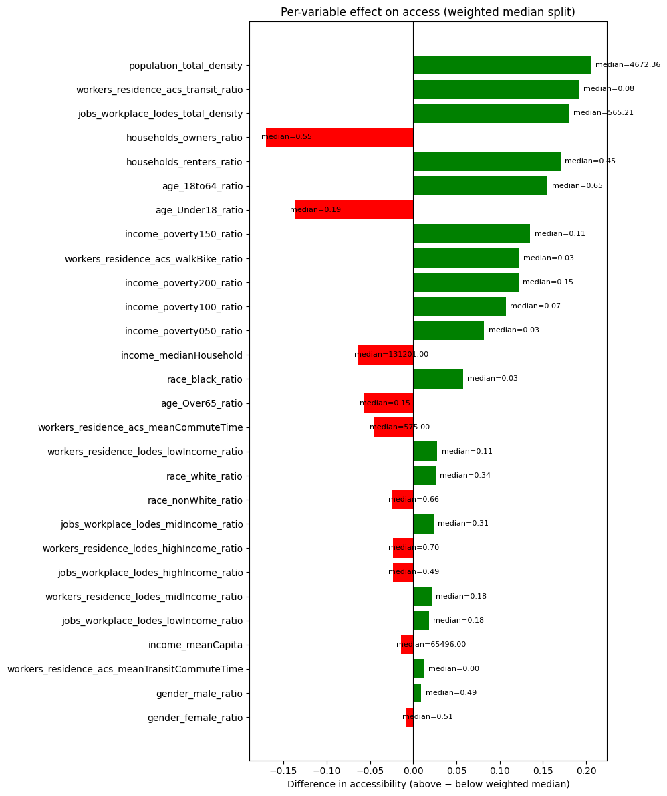
  

---

# Equity 

  <!-- Left column: Text with top gap -->
  

  - Population density

  - Home ownership 

  - Car ownership

  - Race

  - Income

  

  <!-- Right column: Image aligned to top -->
  

    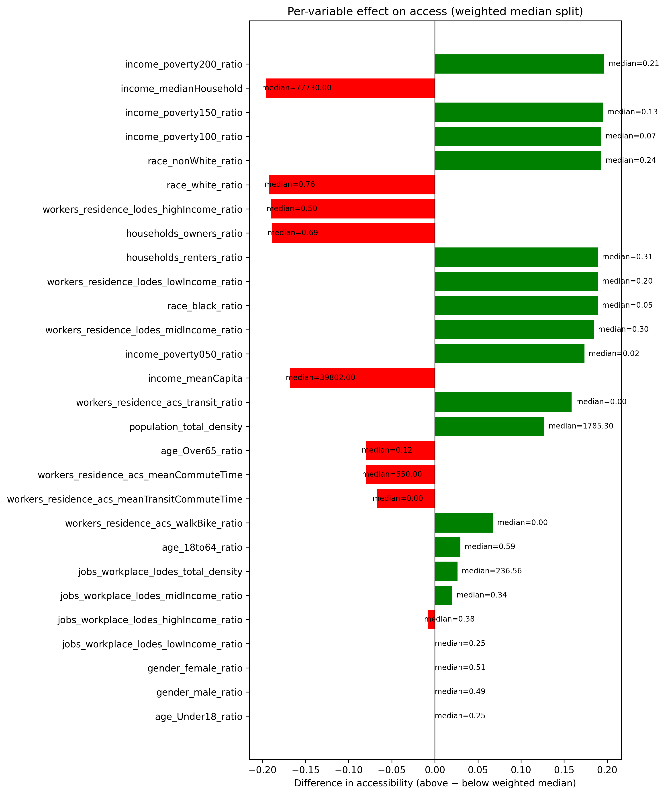
  

--- 

# Ranking: Bottom

  

  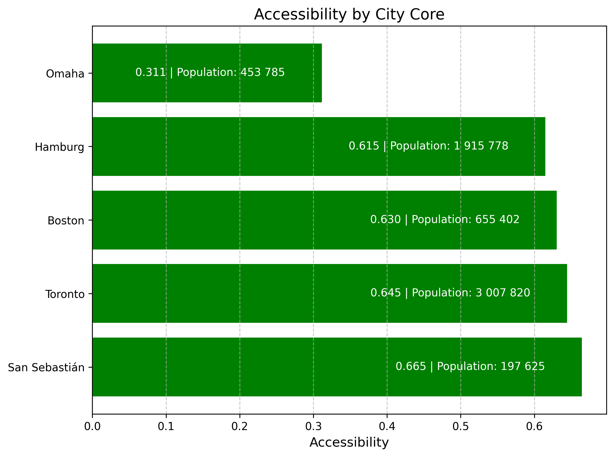

  

  

  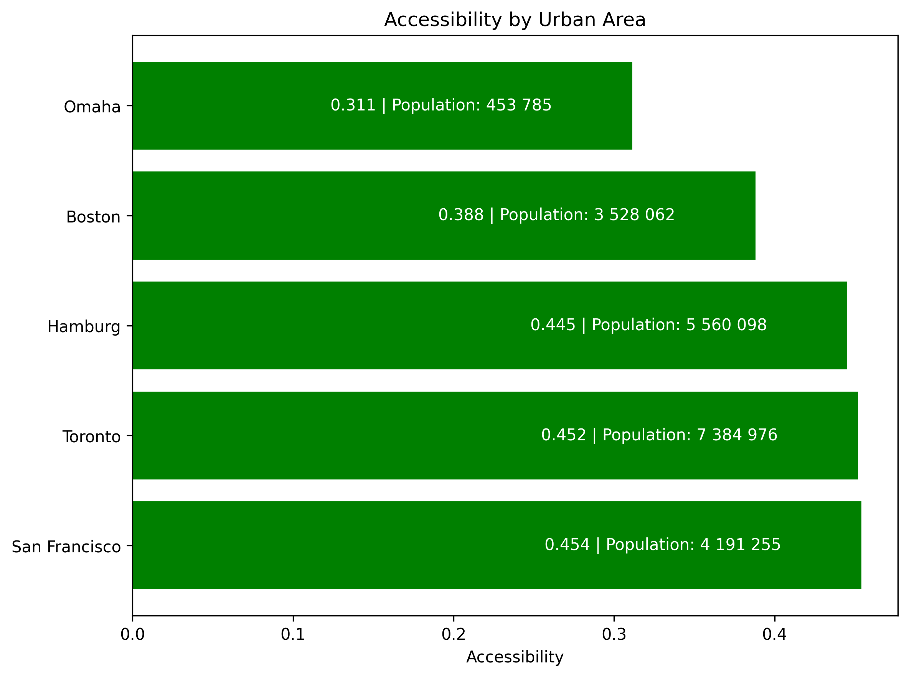

  

--- 

# Ranking: Top

  

  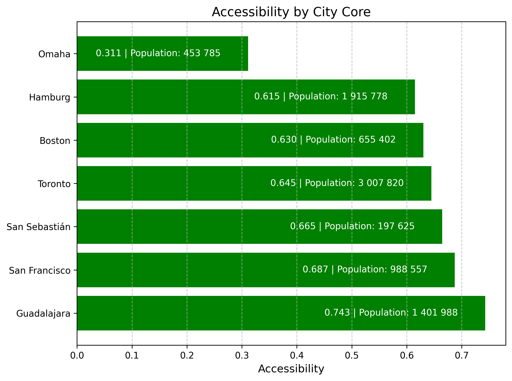

  

  

  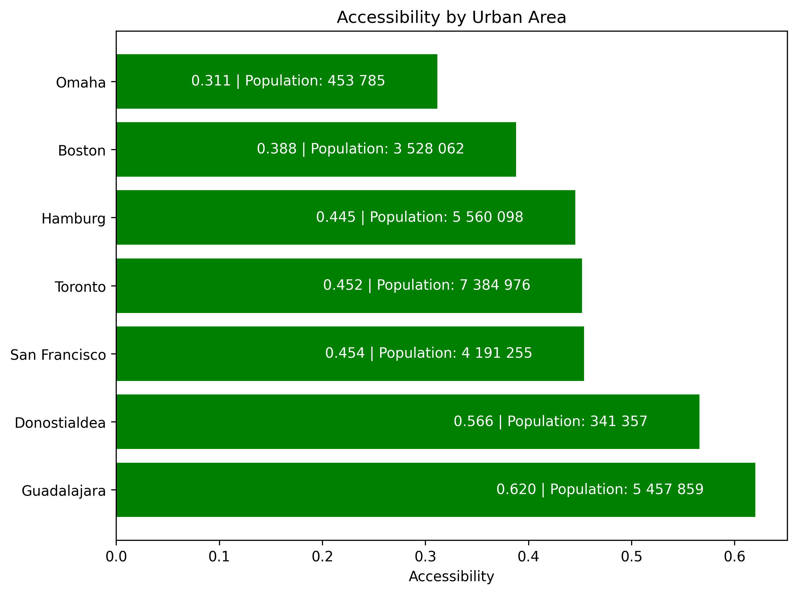

  

--- 

# Python packages

<!-- Left column -->

<h2>
<a href="https://github.com/CityScope/pyGTFSHandler" style="text-decoration: none;">
  PyGTFSHandler
</a>
</h2>

<ul style="margin-top: 0.5rem;">
  <li>
    <a href="https://github.com/CityScope/pyGTFSHandler/blob/main/examples/example.ipynb"
       style="text-decoration: none;">
      Tutorial
    </a>
    
      Download GTFS and compute speed and headway
    
  </li>
</ul>

<!-- Right column -->

<h2>
<a href="https://github.com/CityScope/UrbanAccessAnalyzer" style="text-decoration: none;">
  UrbanAccessAnalyzer
</a>
</h2>

<ul style="margin-top: 0.5rem;">
  <li>
    <a href="https://github.com/CityScope/UrbanAccessAnalyzer/blob/main/examples/rural_schools.ipynb"
       style="text-decoration: none;">
      Schools
    </a>
    
      Basic example and download of PoIs from OpenStreetMap
    
  </li>
   
  <li>
    <a href="https://github.com/CityScope/UrbanAccessAnalyzer/blob/main/examples/green_spaces.ipynb"
       style="text-decoration: none;">
      Parks
    </a>
    
      Simple tutorial introducing PoI quality
    
  </li>
   
  <li>
    <a href="https://github.com/CityScope/UrbanAccessAnalyzer/blob/main/examples/worldwide_public_transport.ipynb"
       style="text-decoration: none;">
      Public Transport
    </a>
    
      Complete example of our accessibility to public transport indicator including isochrone computation and GTFS processing
    
  </li>
</ul>

---

# A good relationship with data?

<!-- Left side: bullet points -->

- What data gets collected? 

- Decision informed data

<!-- Right side: map -->

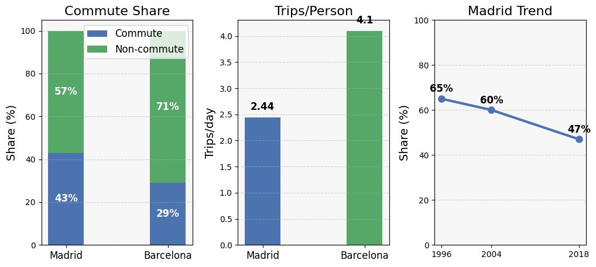

---

# A good relationship with data?

<!-- Left side: bullet points -->

- What data gets collected? 

- Decision informed data

- What data should exist?

<!-- Right side: map -->

  <iframe
    src="html/bbc/index.html"
    style="width: 100%; height: 450px; border: w;">
  </iframe>
<!--  -->

---

# A good relationship with data?

<!-- Left side: bullet points -->

- Data governance and monopolization

  - Google [dominates](https://www.justinobeirne.com/how-many-people-use-google-maps-compared-to-apple-maps)

  - [OpenStreetMap](https://www.openstreetmap.org/about)

<!-- Right side: map -->

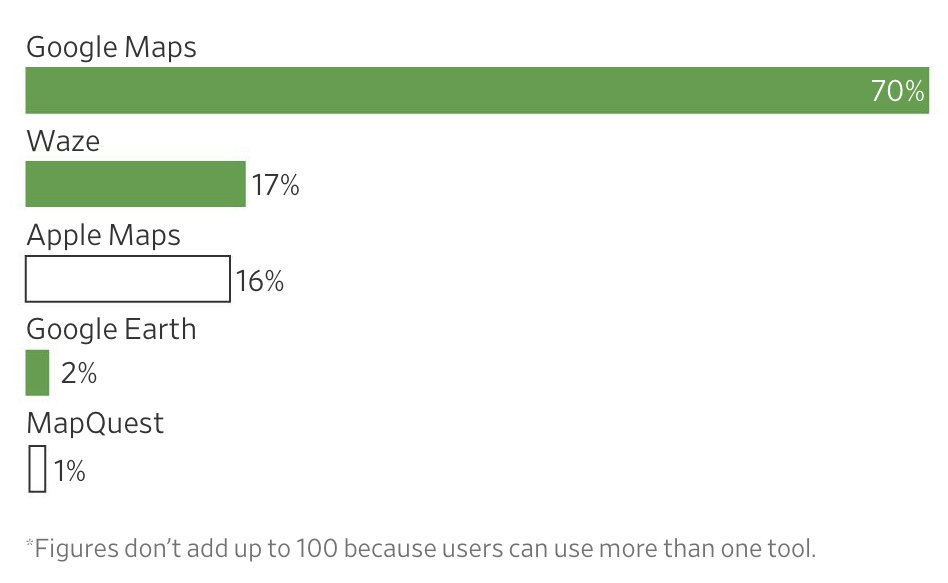

---

# A good relationship with data?

<!-- Left side: bullet points -->

- Who is looking? 

- Data science is not objetive!

<!-- Right side: map -->

---

# Look up!

<!-- Left side: bullet points -->

- Poverty does not just exist

- A system makes it happen

- Who profits? 

<!-- Right side: map -->

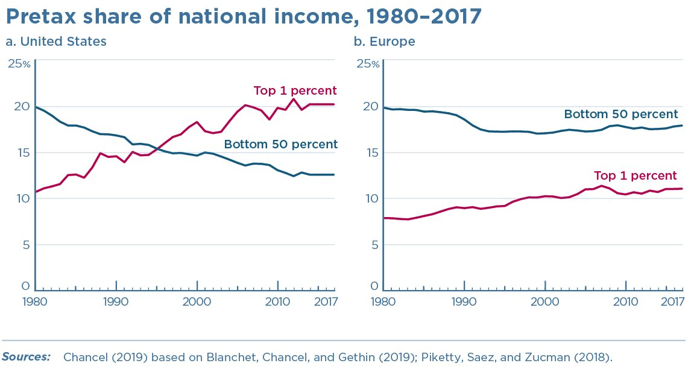

---

# How does the world change?

  <!-- Image centered -->
  

    
  

---

# How does the world change?

  <!-- Image centered -->
  

    
  

---

  <!-- Image centered -->
  

    
  

--- 

# Data as a pressure mechanism?

---
<!-- _class: last -->
# Questions?
## Thank you!

Miguel Ureña Pliego
Contact: miguelup@mit.edu
miguel.urena.pliego@gmail.com

Github: [MiguelUrenaPliego](https://github.com/MiguelUrenaPliego)
LinkedIn: [miguel-urena-pliego](www.linkedin.com/in/miguel-urena-pliego)

